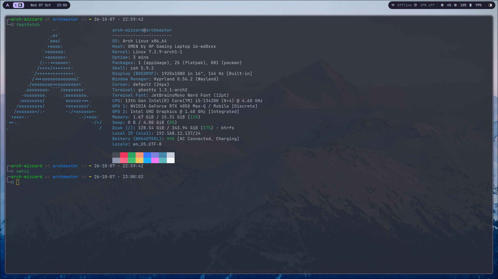

# atHome

My personal dotfiles, managed with [chezmoi](https://www.chezmoi.io/).
They target **Arch Linux** (Hyprland desktop) first, and include a small setup for **macOS**.



## What's inside

| Tool | Path | Notes |
| --- | --- | --- |
| [Hyprland](https://hypr.land/) | `~/.config/hypr` | Lua config split into modules (keybinds, rules, autostart…), plus hyprlock, hyprpaper and hyprlauncher |
| [Quickshell](https://quickshell.org/) | `~/.config/quickshell` | Custom status bar: workspaces with app icons, clock, network, system stats, tray and a volume/brightness OSD |
| [Ghostty](https://ghostty.org/) | `~/.config/ghostty` | Templated per OS, Bluloco Dark theme, custom cursor shaders |
| [Neovim](https://neovim.io/) | `~/.config/nvim` | lazy.nvim setup with LSP, Treesitter, Telescope, Neo-tree, Oil, Lazygit and more; several themes (Nordic by default) |
| [Helix](https://helix-editor.com/) | `~/.config/helix` | Catppuccin Mocha, `;` for command mode, `Ctrl+g` opens Lazygit |
| Zsh | `~/.zshrc` | Oh My Zsh (`fino-time` theme) with autosuggestions and syntax highlighting |

## Install

On a fresh machine:

```bash
sh -c "$(curl -fsLS get.chezmoi.io)" -- init --apply HoneyChasey/atHome
```

If chezmoi is already installed:

```bash
chezmoi init --apply HoneyChasey/atHome
```

### What happens on apply

- **Packages**: everything is listed in [`.chezmoidata/packages.yaml`](.chezmoidata/packages.yaml).
  - **Arch**: installs pacman packages, enables `tlp` and `NetworkManager`, masks `power-profiles-daemon` and `systemd-rfkill`, and installs Flatpak apps from Flathub (Zen Browser, Discord, Obsidian, LocalSend…).
  - **macOS**: installs the Homebrew formulae with `brew bundle`.

  These scripts are `run_onchange_`, so they run again only when `packages.yaml` changes.
- **External plugins**: Oh My Zsh, `zsh-autosuggestions` and `zsh-syntax-highlighting` are downloaded through [`.chezmoiexternal.toml`](.chezmoiexternal.toml) and refreshed every week.

> [!WARNING]
> The Arch script runs `sudo pacman` and `systemctl` commands. Read `packages.yaml` before applying on a machine you care about.

## Hyprland keybinds

`SUPER` is the main modifier.

| Keys | Action |
| --- | --- |
| `SUPER + A` | Terminal (Ghostty) |
| `SUPER + E` | File manager (Yazi) |
| `SUPER + B` / `SUPER + SHIFT + B` | Zen Browser / private window |
| `SUPER + C` | Close window |
| `SUPER + F` | Toggle fullscreen |
| `SUPER + V` | Toggle floating |
| `SUPER + J` | Toggle split |
| `SUPER + Arrows` | Move focus |
| `SUPER + 1…0` | Go to workspace |
| `SUPER + SHIFT + 1…0` | Move window to workspace |
| `SUPER + P` / `SHIFT + P` / `SHIFT + O` | Screenshot window / region / output |
| `SUPER + L` | Lock screen |
| `SUPER + M` | Exit Hyprland |
| `SUPER + Left click` | Drag / resize window |

Media, volume and brightness keys work too. Workspace binds use a QWERTY layout; an AZERTY version is commented out in [`keybinds.lua`](dot_config/hypr/hyprland/keybinds.lua).

## Daily use

```bash
chezmoi edit ~/.config/hypr/hyprland.lua   # edit a file in the source
chezmoi diff                               # preview changes
chezmoi apply                              # apply them
chezmoi update                             # pull from the repo and apply
```

## More docs

- [Hyprland notes](dot_config/hypr/readme.md): Lua stubs for the LSP, audio firmware (SOF)
- [Quickshell bar](dot_config/quickshell/readme.md): how app icons are found, reloading the bar
- [Neovim ftplugin](dot_config/nvim/ftplugin/README.md): per-filetype settings
